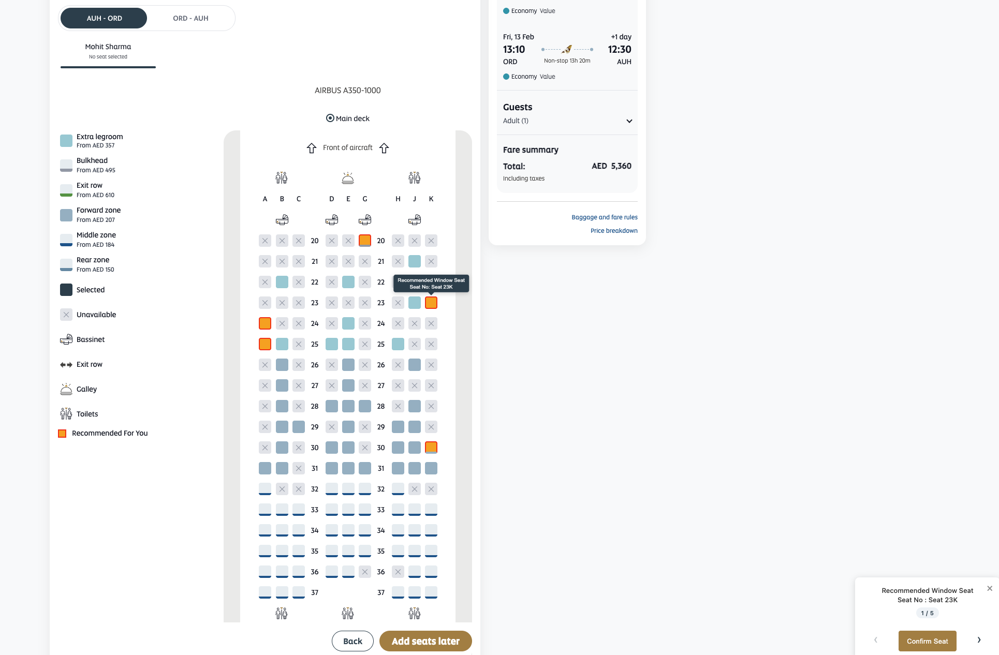

# ✈️ Flight Seats Recommendation

> An intelligent seat selection enhancement system that provides personalized seat recommendations with an interactive nudge interface for airline booking pages.

---

## 📸 Preview



*The interface displays:*
- 🟠 **Orange highlighted seats** - Recommended seat options
- 📱 **Floating nudge panel** - Interactive navigation controls (bottom right)
- 💬 **Tooltips** - Seat information on hover/navigation
- 📋 **Legend section** - "Recommended For You" indicator
- 🗺️ **Interactive seat map** - Clear visual seat recommendations

---

## 🎯 Overview

The Flight Seats Recommendation system is an intelligent seat selection tool that automatically analyzes available seats, user preferences, and pricing to highlight the best seat options. It provides a seamless user experience with personalized recommendations through an interactive nudge interface.

## ✨ Features

### 🧠 Intelligent Seat Recommendations
- Automatically analyzes and recommends seats based on:
  - User's saved seat preferences (Window/Aisle)
  - Seat availability and pricing
  - Seat characteristics (Exit row, Bulkhead, Zone preferences)
  - Window/Aisle distribution algorithm

### 🎮 Interactive Nudge Interface
- Floating nudge panel with seat recommendations
- Navigation arrows to browse through recommended seats
- Seat counter showing current position (e.g., "1/5")
- Confirm button for quick seat selection
- Close button to dismiss nudge

### 🎨 Visual Highlights
- Orange background with red border for recommended seats
- Tooltips showing seat information (configurable)
- Smooth scrolling to highlighted seats
- Legend section for "Recommended For You" indicator

### 🧮 Smart Seat Selection Algorithm
- 70/30 split preference for Window/Aisle seats when available
- Dynamic adjustment based on seat availability
- Handles edge cases (only window or only aisle seats available)
- Maximum price or minimum price selection (configurable)

### 📱 Responsive Design
- Works seamlessly on desktop and mobile views
- Mobile-specific legend support
- Adaptive UI elements

## 📋 Prerequisites

- ✅ Modern web browser (Chrome, Firefox, Safari, Edge)
- ✅ Flickerlessly library (included in the code)
- ✅ Adobe Experience Platform (AEP) integration for user data
- ✅ Target/Adobe Target integration for profile data

---

## 🚀 Installation & Setup

### Step 1: Include the Script

Add the `seats-rec-nudge.html` script to your page. You can either:

**Option A: Inline Script**
```html
<script>
    // Copy the entire content of seats-rec-nudge.html here
</script>
```

**Option B: External File**
```html
<script src="path/to/seats-rec-nudge.html"></script>
```

### Step 2: Required HTML Structure

The script expects the following HTML structure to be present:

```html
<!-- Seatmap container -->
<refx-seatmap-matrix-pres>
    <!-- Available seats with class .available -->
    <div class="available front-seat">
        <span class="seat-number">12A</span>
        <span class="seat-characteristics-sr">Window Seat</span>
    </div>
</refx-seatmap-matrix-pres>

<!-- Legend sections -->
<div class="legend-desktop">
    <!-- Desktop legend -->
</div>

<div class="seatmap-legend-mobile .legend-container .legend-mobile">
    <!-- Mobile legend -->
</div>

<!-- Tab navigation (optional) -->
<div class="mat-mdc-tab-list">
    <div class="mdc-tab">Tab 1</div>
</div>
```

### Step 3: Server-Side Variables

The script requires the following server-side variables to be populated:

```javascript
// From Adobe Experience Platform
'${aep._etihadairways.identities.etihadGuestID default=""}'
'${aep._etihadairways.guestInfo.preferences.preferredSeatCharacteristic default=""}'

// From Target/Profile
'${profile.seatTDNA}'
```

### Step 4: CSS Styles

The script includes inline styles, but ensure your page has the following base styles:

```css
.highlighted-seat {
    background-color: orange !important;
    border: 2px solid red !important;
}

.rec-icon {
    width: 16px;
    height: 16px;
    background-color: orange;
    border: 2px solid red;
    display: inline-block;
    margin-right: 8px;
    vertical-align: middle;
}

.seatnudge {
    display: flex !important;
}
```

---

## ⚙️ Configuration

### Main Configuration Constants

Edit the `CONSTANTS` object at the top of the script to customize behavior:

```javascript
var CONSTANTS = {
    // Number of seats to highlight (default: 5)
    HIGHLIGHT_LIMIT: 5,
    
    // Window seat bias percentage (default: 0.7 = 70%)
    WINDOW_BIAS: 0.7,
    
    // Minimum window seat percentage to trigger 70/30 split (default: 30)
    WINDOW_PERCENTAGE_THRESHOLD: 30,
    
    // Window ratio multiplier for low window seat availability (default: 1.5)
    WINDOW_RATIO_MULTIPLIER: 1.5,
    
    // Window/Aisle split ratios (default: 0.7 window, 0.3 aisle)
    WINDOW_SPLIT_RATIO: 0.7,
    AISLE_SPLIT_RATIO: 0.3,
    
    // Delay before highlighting seats after tab click (ms) (default: 3000)
    TAB_CLICK_DELAY: 3000,
    
    // Enable/disable tooltip functionality (default: true)
    SHOW_TOOLTIP: true,
    
    // Use maximum price instead of minimum (default: true)
    // Set useMaxPrice variable to false for minimum price
    // useMaxPrice: true
};
```

### Key Configuration Variables

```javascript
// Set to true to find maximum price, false for minimum price
var useMaxPrice = true;

// Highlight limit (uses CONSTANTS.HIGHLIGHT_LIMIT by default)
var heighLightLimit = CONSTANTS.HIGHLIGHT_LIMIT;
```

---

## 📖 Usage

### Basic Usage

Once installed, the script automatically:

1. **Waits for seatmap to load** using Flickerlessly library
2. **Analyzes available seats** when `.selectable-button` elements appear
3. **Highlights recommended seats** based on algorithm
4. **Shows nudge interface** with navigation controls
5. **Updates on tab clicks** for different flight segments

### User Interactions

#### Nudge Interface Controls

- **Left Arrow (◄)**: Navigate to previous recommended seat
- **Right Arrow (►)**: Navigate to next recommended seat
- **Confirm Seat Button**: Selects the current highlighted seat
- **Close Button (×)**: Dismisses the nudge interface

#### Hover Behavior

- **Hovering on highlighted seats**: Tooltips are hidden (if enabled)
- **Hovering on seatmap matrix**: Tooltips are hidden
- **Navigating via arrows**: Tooltips are shown and seat scrolls into view

### Automatic Cleanup

The nudge automatically removes when:
- User clicks "Confirm Seat" button
- User selects a seat (`.selectable-button.selected-active` appears)
- User clicks the close button

---

## 🔧 Key Functions

### `highlightSeats()`
Main function that analyzes and highlights recommended seats. Called automatically when seatmap loads or tab is clicked.

### `showNudgeWithNavigation(seatsArray)`
Creates and displays the nudge interface with navigation controls.

**Parameters:**
- `seatsArray`: Array of seat objects with `{seat: element, type: "Window Seat" | "Aisle Seat"}`

### `updateNudgeContent(shouldScroll, skipTooltip)`
Updates the nudge content when navigating between seats.

**Parameters:**
- `shouldScroll`: Boolean - Whether to scroll to seat (default: true)
- `skipTooltip`: Boolean - Whether to skip showing tooltip (default: false)

### `addTooltip(seatEl, seatType, seatNumber, forceShow)`
Adds a tooltip to a seat element.

**Parameters:**
- `seatEl`: DOM element of the seat
- `seatType`: String - "Window Seat" or "Aisle Seat"
- `seatNumber`: String - Seat number (e.g., "12A")
- `forceShow`: Boolean - Force immediate display

### `clearOldNudges()`
Removes all nudge elements and cleans up event handlers.

---

## 📚 Constants Reference

### Configuration Constants

| Constant | Default | Description |
|----------|---------|-------------|
| `HIGHLIGHT_LIMIT` | 5 | Maximum number of seats to highlight |
| `WINDOW_BIAS` | 0.7 | Window seat preference bias (70%) |
| `WINDOW_PERCENTAGE_THRESHOLD` | 30 | Minimum window % for 70/30 split |
| `WINDOW_SPLIT_RATIO` | 0.7 | Window seat ratio in split |
| `AISLE_SPLIT_RATIO` | 0.3 | Aisle seat ratio in split |
| `TAB_CLICK_DELAY` | 3000 | Delay before highlighting (ms) |
| `SHOW_TOOLTIP` | true | Enable/disable tooltips |

### Selector Constants

All CSS selectors are defined in the `CONSTANTS` object for easy customization:

- `SELECTOR_SELECTABLE_BUTTON`: Main button selector
- `SELECTOR_SEATMAP`: Seatmap container
- `SELECTOR_AVAILABLE`: Available seats
- `SELECTOR_FRONT_SEAT`: Front section seats
- `SELECTOR_SEAT_CHAR`: Seat characteristics element
- `SELECTOR_LEGEND_DESKTOP`: Desktop legend container
- `SELECTOR_LEGEND_MOBILE`: Mobile legend container
- And more...

---

## 🧮 Seat Selection Algorithm

### Algorithm Flow

1. **Check for user preference**:
   - If user has saved preference (WINDOW/AISLE), use that
   - Otherwise, use intelligent algorithm

2. **Price-based filtering** (if available):
   - Finds highest/lowest priced seat section
   - Maps to seat characteristics (Exit row, Bulkhead, Zones)

3. **Seat collection**:
   - Collects all available window and aisle seats
   - Filters by seat characteristics if price-based filtering found a match

4. **Distribution calculation**:
   - If window seats ≥ 30%: 70% window, 30% aisle
   - If window seats < 30%: Proportional with multiplier
   - Handles edge cases (only window or only aisle available)

5. **Highlighting**:
   - Highlights window seats first
   - Then highlights aisle seats
   - Maximum of `HIGHLIGHT_LIMIT` seats total

---

## 🌐 Browser Compatibility

- ✅ Chrome 90+
- ✅ Firefox 88+
- ✅ Safari 14+
- ✅ Edge 90+
- ✅ Mobile browsers (iOS Safari, Chrome Mobile)

---

## 🔍 Troubleshooting

### Nudge Not Appearing

**Issue**: Nudge interface doesn't show up

**Solutions**:
1. Check browser console for errors
2. Verify `.selectable-button` elements exist
3. Ensure Flickerlessly library is loaded
4. Check that `recommendedSeats` array is not empty
5. Verify seatmap container (`refx-seatmap-matrix-pres`) exists

### Seats Not Highlighting

**Issue**: Recommended seats are not being highlighted

**Solutions**:
1. Check `HIGHLIGHT_LIMIT` constant value
2. Verify seat selectors match your HTML structure
3. Check console for seat detection logs
4. Ensure seats have `.available` class
5. Verify seat characteristics are readable

### Tooltips Not Showing

**Issue**: Tooltips don't appear on seats

**Solutions**:
1. Check `SHOW_TOOLTIP` constant (should be `true`)
2. Verify tooltip CSS is not being overridden
3. Check browser console for errors
4. Ensure seat elements are positioned correctly

### Nudge Not Removing

**Issue**: Nudge stays visible after seat selection

**Solutions**:
1. Verify `.confirm-seat-button` click handler
2. Check `.selectable-button.selected-active` detection
3. Ensure `clearOldNudges()` is being called
4. Check for JavaScript errors preventing cleanup

### Performance Issues

**Issue**: Script runs slowly or causes lag

**Solutions**:
1. Reduce `HIGHLIGHT_LIMIT` value
2. Increase `TAB_CLICK_DELAY` for slower devices
3. Disable tooltips (`SHOW_TOOLTIP: false`)
4. Check for memory leaks in event handlers

---

## 🏗️ Code Structure

```
seats-rec-nudge.html
├── Constants Definition
│   ├── Configuration
│   ├── Selectors
│   ├── Class Names
│   ├── Seat Type Strings
│   └── Messages
├── Variables
│   ├── User Data (from AEP/Target)
│   ├── State Variables
│   └── DOM Method Caching
├── Utility Functions
│   ├── shouldSkip()
│   ├── preferWindow()
│   └── DOM Method Bindings
├── Flickerlessly Initialization
├── Main Functionality
│   ├── highlightSeats()
│   ├── showNudgeWithNavigation()
│   ├── updateNudgeContent()
│   ├── addTooltip()
│   ├── removeTooltip()
│   └── Event Handlers
└── Styles
    ├── Highlighted Seat Styles
    ├── Nudge Interface Styles
    └── Tooltip Styles
```

---

## 🎨 Customization Examples

### Disable Tooltips

```javascript
CONSTANTS.SHOW_TOOLTIP = false;
```

### Change Highlight Limit

```javascript
CONSTANTS.HIGHLIGHT_LIMIT = 3; // Show only 3 recommendations
```

### Use Minimum Price Instead of Maximum

```javascript
var useMaxPrice = false; // Find minimum price instead
```

### Adjust Window/Aisle Split

```javascript
CONSTANTS.WINDOW_SPLIT_RATIO = 0.8; // 80% window
CONSTANTS.AISLE_SPLIT_RATIO = 0.2; // 20% aisle
```

### Change Tab Click Delay

```javascript
CONSTANTS.TAB_CLICK_DELAY = 2000; // 2 seconds instead of 3
```

---

## 📦 Dependencies

- **Flickerlessly**: Included in the code, handles DOM element detection
- **Adobe Experience Platform**: For user identity and preferences
- **Adobe Target**: For profile data (`profile.seatTDNA`)

---

## 📝 Version History

- **v1.0**: Initial release with basic seat recommendation and nudge interface
- **v1.1**: Added tooltip functionality and hover handlers
- **v1.2**: Added mobile legend support and automatic cleanup

---

## 💬 Support

For issues or questions:
1. Check the Troubleshooting section
2. Review browser console for errors
3. Verify all prerequisites are met
4. Check that server-side variables are populated correctly

---

## 📄 License

**Proprietary** - Etihad Airways

---

> **Note**: This script is designed specifically for Etihad Airways booking system and requires specific HTML structure and server-side integrations.
